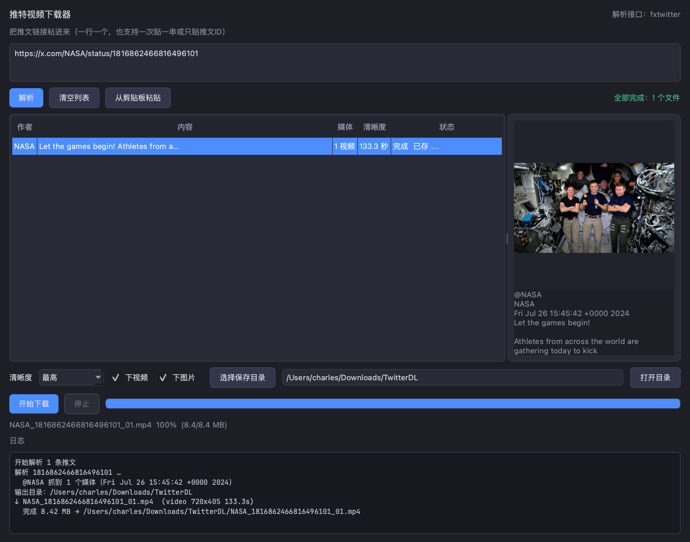

# 推特视频下载器

一个 macOS 桌面小工具，粘贴推文链接就能把视频和原图存下来。图形界面，不用命令行，不依赖 yt-dlp 也能跑。

下载 X（推特）视频与图片 · 多清晰度选择 · 批量队列 · 纯标准库 HTTP



## 功能

- **粘贴即用**：一行一个链接，也可以一次贴一整串，或者只贴推文 ID
- **清晰度可选**：把推文里所有可用的 mp4 档位都列出来（常见 1080p / 720p / 360p），选中哪档就下哪档
- **视频 + 原图**：视频走直链下载，图片自动加 `?name=orig` 拿原图，不是压缩版
- **批量队列**：多条目串行下载，进度条 + 每条状态独立显示
- **后台线程**：解析和下载都不占界面，下载中可以随时停止
- **不留残片**：先写 `.part` 临时文件，完整下载完才改名，中途失败不会留下半个坏文件
- **接口三级兜底**：`fxtwitter` → `vxtwitter` → 本机 `yt-dlp`（装了就用，没装也不影响）
- **封面预览**：每条推文自动抓缩略图，点一下就能看

## 快速开始

### 方式一：直接用（推荐）

从 [Releases](../../releases) 或 `dist/推特视频下载器_mac_arm64.zip` 拿到打包好的 app，解压后拖进「应用程序」即可。独立的 arm64 应用，**不需要装 Python、不需要装任何依赖**。

> 首次打开如果提示「无法验证开发者」，在「系统设置 → 隐私与安全性」里点一次「仍要打开」即可。

### 方式二：从源码跑

```bash
git clone https://github.com/<你的用户名>/tw-video-downloader.git
cd tw-video-downloader

python3 -m venv .venv
.venv/bin/pip install -r requirements.txt
.venv/bin/python main.py
```

### 方式三：自己打包成 .app

```bash
./build_mac.sh
# 产物：dist/推特视频下载器.app
```

打包脚本会自动建 venv、生成图标、调 PyInstaller。Windows 需要把 `--windowed` 那套命令搬到 Windows 机器上（PyInstaller 不支持交叉编译）。

## 命令行版

不想开界面，或者要批量下载，用 `tools/twdl.sh`（依赖 `yt-dlp`，用 Homebrew 装）：

```bash
./tools/twdl.sh "https://x.com/用户/status/推文ID"
./tools/twdl.sh -o ~/Desktop "链接1" "链接2"
```

## 工作原理

整条链路只用了 Python 标准库（`urllib` + `json`），没有第三方依赖：

1. **解析链接** → 正则抽出 `用户名` 和 `推文ID`，`x.com` / `twitter.com` / `/i/status/` / 裸 ID 都认
2. **拉元信息** → 请求 `api.fxtwitter.com`，拿到结构化 JSON：作者、正文、每个媒体的全部清晰度档位、时长、缩略图
3. **选档位** → 按码率排序，把 URL 里的分辨率解析成档位名；**竖屏视频按短边命名**（`720x1280` 就是 720p，不是 1280p）
4. **下载** → 带 `User-Agent` 和 `Referer` 流式下载，64KB 一块，边下边报进度，先写 `.part` 再改名

失败时的兜底顺序：`fxtwitter` → `vxtwitter` → 本机 `yt-dlp`。三个都挂才会报错，错误信息会逐条列在日志区。

## 已知限制

- **画质取决于 X 给的转码档位，不是固定值**。同一条推文可能提供 1080p / 720p / 360p 好几档，也可能只有 320p；竖屏视频通常最高卡在 720x1280（源是 1080x1920 也不给 1080p），横屏视频可能给到 1920x1080。下拉框里的选项是**按你解析到的推文动态生成的**，接口给几档就列几档。
- 只支持**公开推文**。受保护账号、需要登录才可见的内容拿不到。
- 依赖第三方接口（fxtwitter / vxtwitter）。它们挂了的时候，如果你本机装了 `yt-dlp` 仍能下载。
- 打包产物是 **arm64 macOS**（M 系列芯片）。Intel Mac 需要重新打包。

## 常见问题

**解析一直失败？**
先确认链接能在浏览器里打开。删掉的推文、受保护账号、纯文字推文都会失败，日志区会写明原因。

**下载到一半断了？**
重跑就行，不会留下半个损坏的文件。长视频建议在网络稳定时下载。

**想改保存目录？**
界面里选，或者直接改输入框里的路径，默认是 `~/Downloads/TwitterDL`。

## 开发

```bash
# 离线单元测试（不需要网络，不需要图形界面）
python3 -m unittest discover -s tests -v

# 离屏冒烟测试（含真实联网解析 + 下载，需要 PySide6）
QT_QPA_PLATFORM=offscreen .venv/bin/python test_smoke.py

# 打包产物的自检（真跑一次解析 + 下载，排查打包环境问题）
"dist/推特视频下载器.app/Contents/MacOS/推特视频下载器" --selftest

# 生成界面截图
QT_QPA_PLATFORM=offscreen .venv/bin/python screenshot.py
```

项目结构：

```
main.py                  入口（--selftest 为打包诊断开关）
twdownloader/
  api.py                 链接解析 / 接口调用 / 流式下载 / yt-dlp 兜底（纯标准库，可离线测试）
  workers.py             三个 QThread worker：解析、抓封面、下载队列
  main_window.py         主窗口
tests/test_offline.py    离线单元测试
tools/twdl.sh            命令行版
make_icon.py             图标生成（QPainter 绘制）
build_mac.sh             一键打包 macOS 应用
```

## 免责声明

仅供个人学习与备份自己有权保存的内容使用。请遵守 X 的服务条款及所在地区法律法规，不要用于侵犯他人版权或隐私。下载内容的版权归原作者所有。

## License

[MIT](LICENSE)
